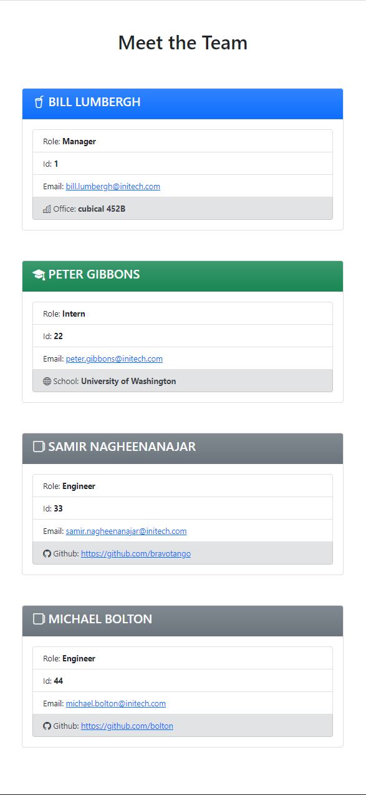

# Team Profile Generator

This is a Node.js command-line application that takes in information about employees on a software engineering team, then generates an HTML webpage that displays summaries for each person. Testing is key to making code maintainable, so there are unit tests for every part of the code to ensure that the application is working without errors.

## Satisfied User Story

```
AS A manager

I WANT to generate a webpage that displays my team's basic info
SO THAT I have quick access to their emails and GitHub profiles
```

## Satisfied Acceptance Criteria

```
GIVEN a command-line application that accepts user input

WHEN I am prompted for my team members and their information
THEN an HTML file is generated that displays a nicely formatted team roster based on user input

WHEN I click on an email address in the HTML
THEN my default email program opens and populates the TO field of the email with the address

WHEN I click on the GitHub username
THEN that GitHub profile opens in a new tab

WHEN I start the application
THEN I am prompted to enter the team manager’s name, employee ID, email address, and office number

WHEN I enter the team manager’s name, employee ID, email address, and office number
THEN I am presented with a menu with the option to add an engineer or an intern or to finish building my team

WHEN I select the engineer option
THEN I am prompted to enter the engineer’s name, ID, email, and GitHub username, and I am taken back to the menu

WHEN I select the intern option
THEN I am prompted to enter the intern’s name, ID, email, and school, and I am taken back to the menu

WHEN I decide to finish building my team
THEN I exit the application, and the HTML is generated
```

## Application structure

```
.
├── __tests__/             //jest tests
│   ├── Employee.test.js
│   ├── Engineer.test.js
│   ├── Intern.test.js
│   └── Manager.test.js
├── dist/                  // rendered output (HTML)
├── lib/                   // classes
├── .gitignore             // indicates which folders and files Git should ignore
├── index.js               // runs the application
└── package.json
```

## Application classes

The application includes `Employee`, `Manager`, `Engineer`, and `Intern` classes. The tests for these classes (in the `_tests_` directory) ALL pass.

The first class is an `Employee` parent class with the following properties and methods:

- `name`

- `id`

- `email`

- `getName()`

- `getId()`

- `getEmail()`

- `getRole()`&mdash;returns `'Employee'`

The other three classes extend `Employee`.

In addition to `Employee`'s properties and methods, `Manager` also have the following:

- `officeNumber`

- `getRole()`&mdash;overridden to return `'Manager'`

In addition to `Employee`'s properties and methods, `Engineer` also have the following:

- `github`&mdash;GitHub username

- `getGithub()`

- `getRole()`&mdash;overridden to return `'Engineer'`

In addition to `Employee`'s properties and methods, `Intern` also have the following:

- `school`

- `getSchool()`

- `getRole()`&mdash;overridden to return `'Intern'`

## Screenshots of generated HTML

The following image shows the generated HTML’s appearance. The styling is leveraging BootStrap CSS 5.

### Desktop screenshot


### Responsive mobile screenshot



## Starting the application

This application uses [Jest](https://www.npmjs.com/package/jest) for running the unit tests and [Inquirer](https://www.npmjs.com/package/inquirer) for collecting input from the user. The application will be invoked by using the following command:

```bash
node index.js
```

## Demo video

[Demo video of running tests & program & output](https://watch.screencastify.com/v/MsUQlvRll3RFSB3oDrYQ)

### Entries used in demo video

```
.
├── Manager
   ├── Bill Lumbergh
   ├── 1
   ├── bill.lumbergh@initech.com
   ├── cubical 452B
├── Intern
   ├── Peter Gibbons
   ├── 22
   ├── peter.gibbons@initech.com
   ├── University of Washington
├── Engineer
   ├── Samir Nagheenanajar
   ├── 33
   ├── samir.nagheenanajar@initech.com
   ├── bravotango
├── Engineer
   ├── Michael Bolton
   ├── 44
   ├── michael.bolton@initech.com
   ├── bolton

```

## Link to output HTML file

[Output HTML file](https://github.com/bravotango/Team-Profile-Generator/blob/main/dist/index.html)
